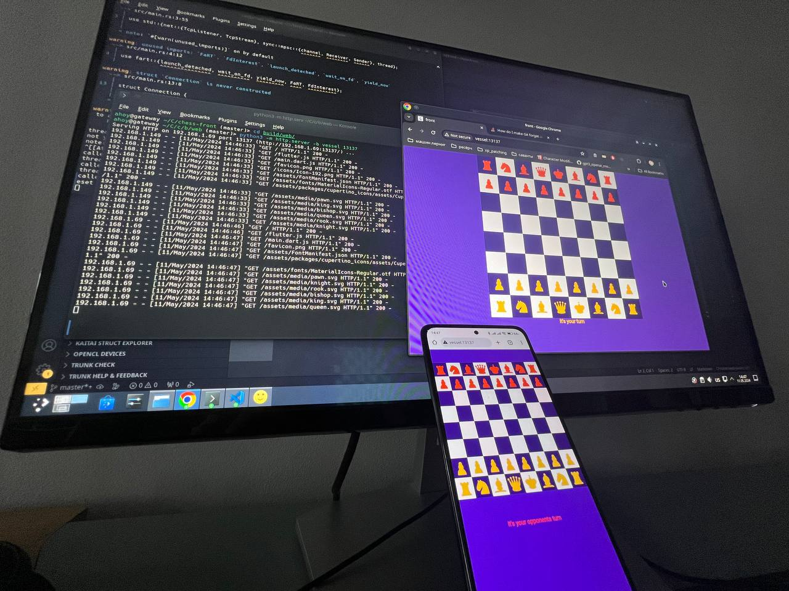

idk why I made it 👀

I actually wanted to try webrtc for peer2peer sessions, and do an [algorithmic opponent](https://www.chessprogramming.org/Recommended_Reading) but... maybe later

Rules mostly follow [this](https://en.wikipedia.org/wiki/Rules_of_chess), excluding
* en passant cus i think it makes pawns op
* castling cus its useless
* promotion cus I didnt bother to implement it yet